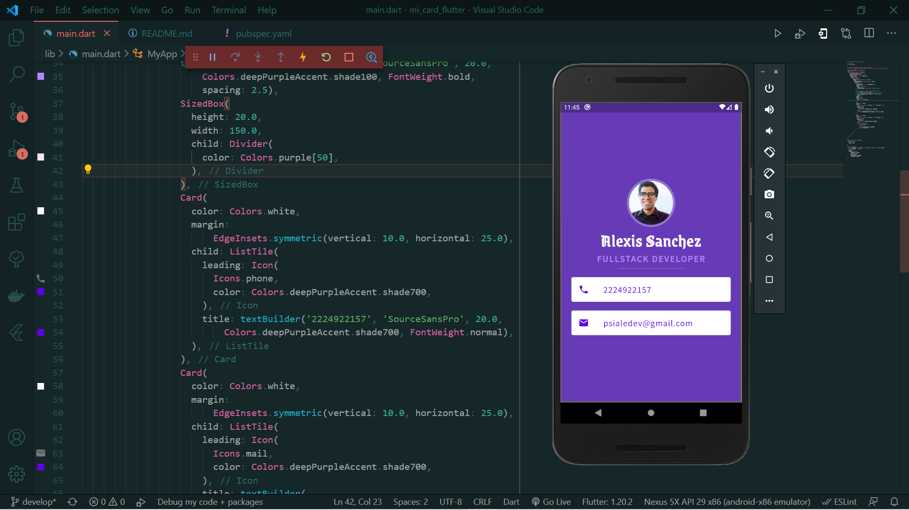

# 🖼️ MiCard - Flutter

## Preview

This project is part of a series of projects to be completed by students of the [AppBrewery](https://www.appbrewery.co/p/flutter-development-bootcamp-with-dart) flutter course.

This project focuses on creating a digital business card.

## 🧮 The Project Brief

The premise of this project is to learn the basic use of widgets to position elements into a phone screen such as: Container, Row, Card, and others.

## 🧬 Technologies & Languages Used

- Dart
- Flutter
- Github
- Google Fonts

## 🛎️ Contributions, Issues & Forking

If you have any issues setting up the project or you come across any unintended bugs or problems, please do submit an issue to the [Mi Card](https://github.com/Psiale/flutter-miCard/issues) page.

If you want to make your own changes, modifications or improvements to our project, go ahead and Fork it!
1. [Fork it](https://github.com/Psiale/flutter-miCard/fork)

2. Create your working branch (git checkout -b [choose-a-name])

3. Commit your changes (git commit -m 'what this commit will fix/add/improve')
4. Push to the branch (git push origin [chosen-name])
5. Create a new Pull Request

## 🤟🏽😄 😛🤙🏾  Creator

Alexis Sanchez - [Github](https://github.com/Psiale)

## 🙌🏾 Show Your Support

Give a ⭐️ if you like this project!

